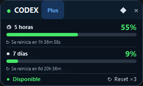

# Codex Usage Monitor

> **Codex Usage Monitor is an unofficial community project and is not
> affiliated with or endorsed by OpenAI.**

Codex Usage Monitor es un widget local para Windows que muestra el porcentaje
usado de Codex en las ventanas de 5 horas y 7 días. Se comunica en modo lectura
con el `codex app-server` que ya exista en el equipo.



## Características

- Ventanas de uso de 5 horas (`primary`) y 7 días (`secondary`).
- `usedPercent` representa porcentaje **usado**, no restante.
- Cuenta atrás calculada a partir del `resetsAt` del último snapshot completo.
- Estado de disponibilidad basado en `ordinaryUsageAllowed`.
- Reset credits mostrados únicamente como información; nunca se consumen.
- Modos completo y compacto.
- Opción `Siempre visible` (TOPMOST).
- Bandeja del sistema, anclaje a pantalla e instancia única.
- Inicio opcional con Windows mediante HKCU, sin privilegios de administrador.
- Detección periódica de Codex: el monitor puede recuperarse si Codex se
  instala mientras permanece abierto.

Si no existe un `codex.exe` compatible, la aplicación sigue funcionando y
muestra `Codex no encontrado`. Si el ejecutable existe pero su app-server
falla, muestra `Error de Codex`.

## Requisitos

- Windows 10 u 11 de 64 bits.
- Una instalación compatible de Codex CLI o de la extensión oficial de Codex
  para VS Code, necesaria para obtener los límites reales.

El instalador incluye el runtime necesario: no requiere Python, workspace ni
entorno virtual en el equipo de destino. No incluye ni instala `codex.exe`.

## Instalación

Descarga el instalador desde
[GitHub Releases](https://github.com/MenghesTech/Codex-Usage-Monitor/releases)
cuando la release esté publicada y ejecuta
`CodexUsageMonitor-Setup-v1.0.0.exe`. La instalación es por usuario, sin UAC,
en `%LOCALAPPDATA%\Programs\Codex Usage Monitor`. Crea un acceso en Inicio y
permite añadir un acceso directo de escritorio.

La aplicación no está firmada digitalmente. SmartScreen o el antivirus pueden
mostrar una advertencia para un ejecutable sin firma.

## Configuración y autostart

Las preferencias se guardan en:

```text
%LOCALAPPDATA%\Codex Usage Monitor\settings.json
```

Se conservan posición, anclaje, modo compacto y TOPMOST. Si la ruta nueva aún
no existe, se migran los campos conocidos desde
`%USERPROFILE%\.codex-usage-monitor-qt-v062.json`; el archivo histórico no se
elimina automáticamente.

`Abrir al iniciar Windows` utiliza exclusivamente el valor por usuario
`CodexUsageMonitor` de `HKCU\Software\Microsoft\Windows\CurrentVersion\Run`.

## Privacidad

- Funciona localmente y usa el `codex app-server` local existente.
- No implementa telemetría, analytics, trackers ni peticiones HTTP propias.
- No lee ni empaqueta `auth.json`.
- No copia tokens, cookies, credenciales ni cabeceras de autorización.
- No muestra ni persiste identificadores de cuenta.
- Solicita `account/rateLimits/read` y escucha
  `account/rateLimits/updated`.
- No llama a `account/rateLimitResetCredit/consume`.

El proceso de Codex conserva la responsabilidad de su conexión y autenticación.
El monitor procesa únicamente los límites de uso devueltos por ese proceso.

## Desinstalación

Desinstala desde Configuración de Windows > Aplicaciones instaladas. Se
eliminan aplicación, runtime, accesos directos y la entrada de autostart si
apunta al EXE instalado. Los settings se conservan para evitar pérdida de
preferencias.

## Desarrollo y build

```powershell
py -3 -m venv .venv
.\.venv\Scripts\python.exe -m pip install -r requirements-dev.txt
.\.venv\Scripts\python.exe -m pytest
powershell -ExecutionPolicy Bypass -File .\build.ps1
powershell -ExecutionPolicy Bypass -File .\build-installer.ps1
```

La build es GUI (`console=False`) y ONEDIR; no se utiliza ONEFILE. La metadata
PE es `1.0.0.0` y la versión de producto es `1.0.0`.

## Licencia y marcas

Código bajo licencia [MIT](LICENSE), copyright © 2026 MenghesTech.

“OpenAI”, “ChatGPT” y “Codex” son marcas de sus respectivos titulares. El
nombre se usa de forma descriptiva para indicar compatibilidad. El icono propio
no utiliza logotipos oficiales de OpenAI o ChatGPT.
